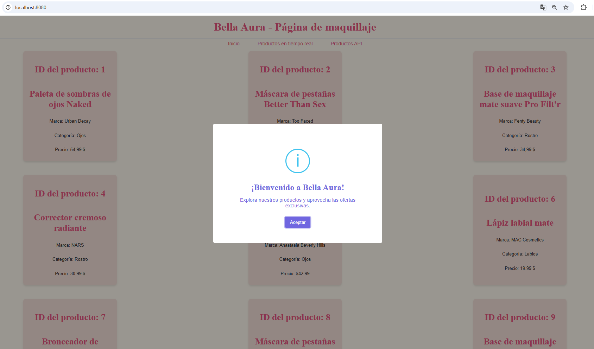
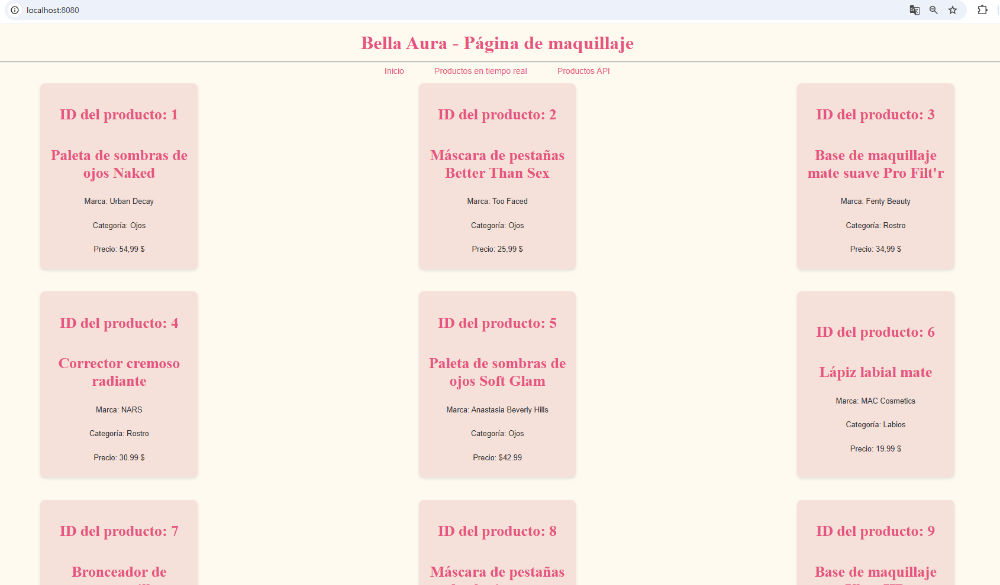
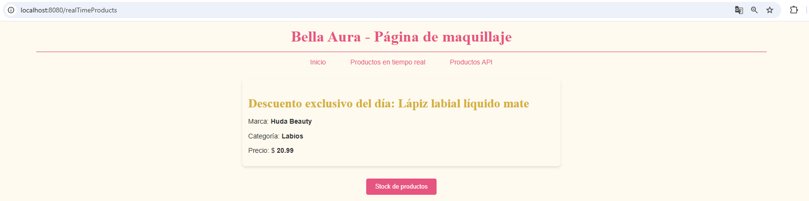
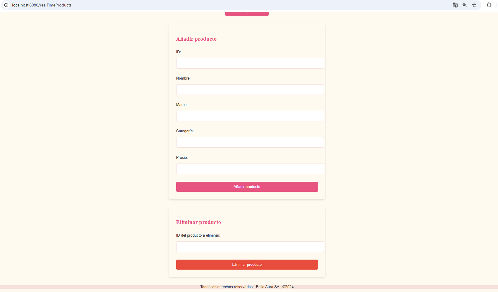
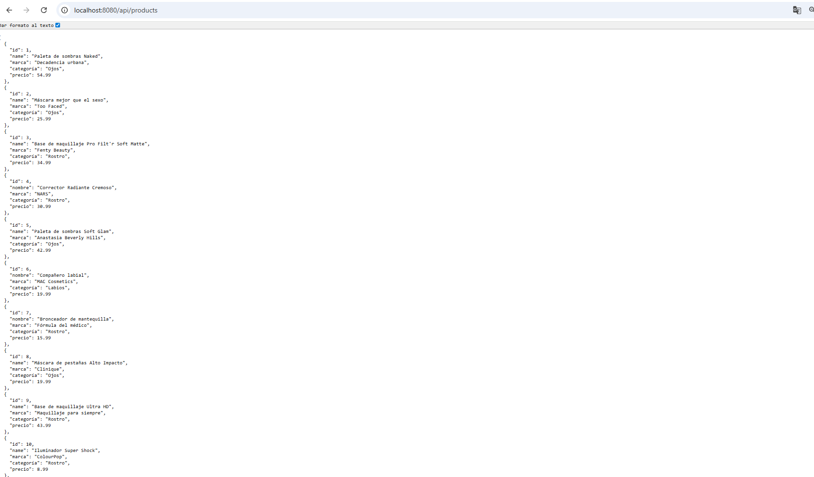

# Bella Aura (Makeup Page)

Aplicación web para mostrar productos de maquillaje con:
- Vista principal con listado de productos
- Vista **Real Time Products** para agregar/eliminar productos
- Endpoint API que devuelve productos en formato JSON

---

## 🧩 Tecnologías usadas
- Node.js
- Express
- Handlebars (vistas)
- Socket.IO (si aplica real time)
- Bootstrap (estilos)

---

## 🚀 Cómo correr el proyecto

### 1️⃣ Clonar el repositorio

```bash
git clone https://github.com/GabrielaAyelenBarrera/javascript-coderhouse.git
cd javascript-coderhouse
```
---

### 2️⃣ Verificar la carpeta del proyecto
Antes de instalar dependencias, verificar que la terminal esté ubicada en la carpeta correcta.

```bash
pwd
```
---
Luego listar los archivos:
```bash
ls
```
---
Debe mostrarse algo similar a: `docs/  javascript-coderhouse/  README.md`

### 3️⃣ Instalar dependencias
Una vez confirmada la carpeta del proyecto, instalar las dependencias:
```bash
npm install 
```
---

### 4️⃣ Levantar servidor

```bash
npm run dev
```
---

El servidor corre en la URL:

`http://localhost:8080/`

En la terminal deberías ver algo como:

`Server escuchando en puerto 8080`

---

## 🌐 Rutas disponibles

🏠 Home
`http://localhost:8080/`

⚡ Real time products
`http://localhost:8080/realTimeProducts`

📦 API products (JSON)
`http://localhost:8080/api/products`

🌐 Consultar productos desde la API

---

## 🏠 Home
GET /
- Muestra el listado de productos en formato de tarjetas
- Página principal del sitio

---

## ⚡ Productos en tiempo real
GET /realTimeProducts

Vista interactiva con:
- Listado de productos
- Formulario para agregar productos
- Formulario para eliminar productos por ID
- Los cambios se reflejan en tiempo real sin recargar la página

---

## 📦 API de productos
GET /api/products

- Devuelve todos los productos en formato JSON Ideal para pruebas con Postman o consumo desde frontend
- Ejemplo de respuesta:

json

```json
[
  {
    "id": 1,
    "name": "Paleta de sombras Desnuda",
    "marca": "Urban Decay",
    "categoria": "Ojos",
    "precio": 54.99
  }
]
```
---

## ✅ Funcionalidades principales
- Visualización de productos de maquillaje
- Agregar productos mediante formulario
- Eliminar productos por ID
- Actualización de productos en tiempo real
- Exposición de datos mediante API REST
- Diseño responsive con Bootstrap

---

## 🧪 Cómo probar la aplicación
➕ Agregar un producto


Ingresar a:
/realTimeProducts

Completar el formulario con:
- ID
- Nombre
- Marca
- Categoría
- Precio
- Presionar Agregar producto
Verificar que:
- Aparezca en la vista
- Se refleje en /api/products

❌ Eliminar un producto
- En la sección Eliminar Producto
- Ingresar el ID del producto
- Presionar Eliminar producto
- Verificar que desaparezca del listado y de la API

---

## 🖼️ Vista previa

🏠 Home




## ⚡ Real Time Products




## 📦 API Products



---

## 👩‍💻 Autora
**Gabriela Ayelén Barrera**  
📫 Contacto: gabrielaayelenbarrera1145@gmail.com  
🔗 LinkedIn: www.linkedin.com/in/gabrielabarrera-

---

